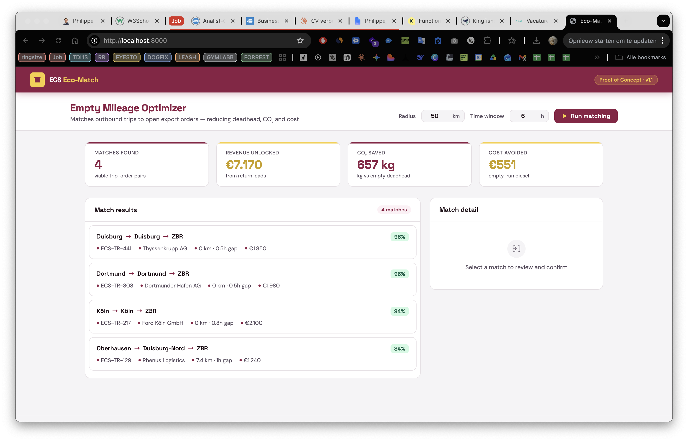
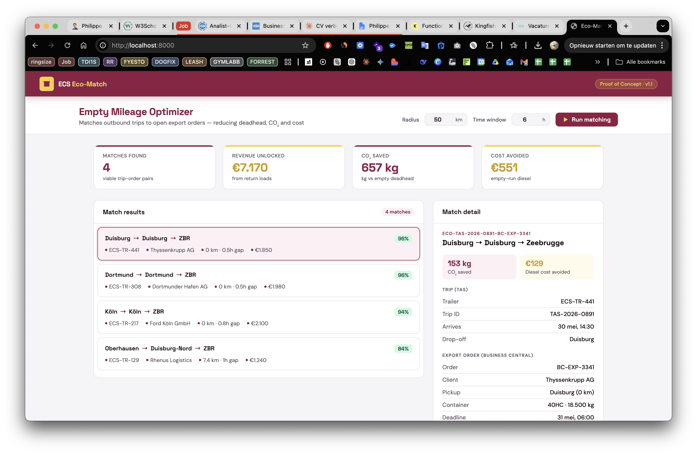

# ECS Eco-Match Engine


**Empty mileage optimizer for intermodal container logistics — built for ECS European Containers.**

Matches outbound trips that would otherwise return empty (**deadhead**) to open export orders in the same region — surfacing revenue opportunities, cutting CO₂ emissions, and saving diesel cost. Planners confirm with a single click.



---

## The problem

In container logistics, trailers frequently return **empty** after dropping a load — pure cost with zero revenue. For a fleet operating across the Zeebrugge hinterland, even a 15 % reduction in empty mileage translates to tens of thousands of euros per year and measurable CO₂ savings.

Planners currently do this matching manually: scrolling through TAS, cross-referencing open export orders in Business Central, calling drivers. It takes time they don't have.

---

## The solution

Eco-Match Engine scans **open export orders** and **outbound trips** simultaneously, then surfaces matches where:

- The trip's **drop-off location** is within X km of the order's **pickup**
- The order is **ready** within a configurable window after the trailer arrives
- A **confidence score** ranks matches by proximity + timing tightness (greedy 1-to-1 — each truck and each order appears in at most one match)

The planner confirms with one click. The system updates TAS, Business Central, and notifies the driver — no emails, no spreadsheets.



---

## Architecture

```
eco-match-engine/
├── api/
│   ├── main.py          # FastAPI app — REST endpoints + Swagger UI
│   ├── matcher.py       # Core matching algorithm + 1-to-1 deduplication
│   └── geo_utils.py     # Haversine distance, CO₂ & cost calculations
├── demo/
│   └── index.html       # ECS-branded planner dashboard (zero JS dependencies)
├── data/
│   └── mock_orders.json # Realistic mock TAS + Business Central data
├── tests/
│   └── test_matcher.py  # 19 unit tests — geo, matching, scoring, edge cases
├── .github/
│   └── workflows/ci.yml # CI — runs tests on every push
├── assets/              # Screenshots for README
├── start.sh             # One-command startup
└── requirements.txt
```

---

## Tech stack

| Layer | Technology |
|---|---|
| API | Python · FastAPI · Pydantic |
| Matching | Haversine geo-match · confidence scoring · greedy 1-to-1 deduplication |
| Frontend | Vanilla HTML/CSS/JS — zero dependencies, no build step |
| Data | JSON (mock TAS + Business Central export) |
| Tests | pytest — 19 tests, 100 % pass rate |
| CI | GitHub Actions |
| Docs | Auto-generated OpenAPI / Swagger at `/docs` |

> **Integration-ready**: the `/confirm/{match_id}` endpoint is a drop-in for a real Power Automate flow. Connect it to your TAS and Business Central APIs and the UI works unchanged.

---

## Quick start

```bash
git clone https://github.com/KippieG/eco-match-engine
cd eco-match-engine
bash start.sh
```

Then open:

- **Dashboard** → http://localhost:8000
- **Swagger docs** → http://localhost:8000/docs

---

## API reference

### `GET /matches`

Return all viable trip-order pairs, ranked by confidence.

| Parameter | Default | Description |
|---|---|---|
| `radius_km` | 50 | Max pickup distance from trip drop-off (km) |
| `time_window_h` | 6 | Max hours between arrival and order ready-time |
| `min_confidence` | 0 | Minimum confidence score (0–100) |

```bash
curl "http://localhost:8000/matches?radius_km=80&time_window_h=8"
```

### `GET /summary`

Aggregate KPIs: total revenue, CO₂ saved, cost avoided.

### `POST /confirm/{match_id}`

Simulate confirming a match — triggers mock updates to TAS, Business Central, and driver notification.

### `GET /health`

Health check — confirms API is live and data is loaded.

---

## Running tests

```bash
pytest tests/ -v
```

```
tests/test_matcher.py::TestHaversine::test_same_point_is_zero PASSED
tests/test_matcher.py::TestHaversine::test_zeebrugge_to_duisburg PASSED
tests/test_matcher.py::TestFindMatches::test_exact_match PASSED
tests/test_matcher.py::TestFindMatches::test_no_match_when_too_far PASSED
tests/test_matcher.py::TestFindMatches::test_sorted_by_confidence PASSED
... 19 passed in 0.02s
```

---

## Business impact — mock data baseline

5 outbound trips · 5 open orders · 50 km radius · 6 h window:

| Match | Truck | Client | Confidence | Revenue |
|---|---|---|---|---|
| Duisburg → Duisburg → ZBR | ECS-TR-441 | Thyssenkrupp AG | **96 %** | €1.850 |
| Dortmund → Dortmund → ZBR | ECS-TR-308 | Dortmunder Hafen AG | **96 %** | €1.980 |
| Köln → Köln → ZBR | ECS-TR-217 | Ford Köln GmbH | **94 %** | €2.100 |
| Oberhausen → Duisburg-Nord → ZBR | ECS-TR-129 | Rhenus Logistics | **84 %** | €1.240 |

| KPI | Value |
|---|---|
| Matches found | **4** |
| Revenue unlocked | **€7.170** |
| CO₂ saved | **~655 kg** |
| Diesel cost avoided | **~€550** |

Scale this to a real fleet of 200+ trailers and the numbers become significant — especially for CSR reporting.

---

## Roadmap

- [ ] **TAS connector** — replace mock JSON with live T-SQL queries via `pyodbc`
- [ ] **Business Central adapter** — read/write orders via BC REST API
- [ ] **Power Automate trigger** — call `/confirm` from a PA flow on planner approval
- [ ] **Power BI dashboard** — export match history to PBIX for management reporting
- [ ] **Multi-day planning** — extend the time window beyond same-day matching

---

## About ECS

[ECS European Containers](https://www.ecs.be) is the operational heart of the port of Zeebrugge — full-load transport, supply chain logistics, conditioned transport, and Brexit & customs services across the UK, Ireland, and the European mainland.

---

## License

MIT — see [LICENSE](LICENSE).

*Built for the Digital Solutions Expert role · Zeebrugge, Belgium*
